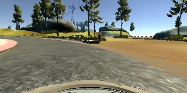

## Behavioral Cloning Project

**Liang Zhang**

The goals / steps of this project are the following:
* Use the simulator to collect data of good driving behavior
* Build, a convolution neural network in Keras that predicts steering angles from images
* Train and validate the model with a training and validation set
* Test that the model successfully drives around track one without leaving the road
* Summarize the results with a written report

## Rubric Points
 Here I will consider the [rubric points](https://review.udacity.com/#!/rubrics/432/view) individually and describe how I addressed each point in my implementation.  

### Files Submitted

#### 1. My project includes the following files:
* model.py containing the script to create and train the model
* drive.py for driving the car in autonomous mode
* model.h5 containing a trained convolution neural network 
* video.mp4 recording the car in autonomous mode
* writeup_report.md summarizing the results

#### 2. Submission includes functional code
Using the Udacity provided simulator and my drive.py file, the car can be driven autonomously around the track by executing 
```sh
python drive.py model.h5
```

#### 3. Submission code is usable and readable

The model.py file contains the code for training and saving the convolution neural network. The file shows the pipeline I used for training and validating the model, and it contains comments to explain how the code works.

### Model Architecture and Training Strategy

#### 1. An appropriate model architecture has been employed

My model is derived from the model of the autonomous vehicle team in Nvidia. 

The input data is normalized in the model using a Keras lambda layer (model.py line 45), which is followed by a cropping layer. 

The model contains five convolutional layers with 5x5 or 3x3 filter sizes and depths between 24 and 64 (model.py lines 47-51). After each convolutional layer,  a RELU layer is included to introduce nonlinearity (model.py lines 47-51). 

Four fully connected layers are followed with a single output (model.py lines 53-54, 56-57). 

#### 2. Attempts to reduce overfitting in the model

After the second fully connected layers, a dropout layer is included (model.py lines 55).

The model was trained and validated on different data sets by using data splitting (model.py line 59). The model was tested by running it through the simulator and ensuring that the vehicle could stay on the track.

#### 3. Model parameter tuning

The model used an Adam optimizer, so the learning rate was not tuned manually (model.py line 59).

#### 4. Appropriate training data

Training data was chosen to keep the vehicle driving on the road. I only used the center lane driving data provided as the sample data.

### Model Architecture and Training Strategy

#### 1. Solution Design Approach

There were three important parts for me to derive the final model. 

The first part is to collect the training data. I started with the given sample data, which recorded the center lane driving behavior. 
Surprisingly this data set is enough for me to derive the final model, so this part was straightforward for me.

The second part is choosing the preprocessing techniques. Firstly I  just used a simple neural network with a fully connected layer to obtained a model. I let the vehicle to drive autonomously on track one to see how the model behaves. The result was not good. Then I added a lambda normalization layer and augmented the data by flipping the images.  These two operations improved the model a bit but not so significantly. Lastly I used a cropping layer to reduce the image size and let the model focus on the important information. After the cropping layer, the car could drive to the bridge on track without problems with the proper EPOCH.  

The third part is that I started to use a well-known deep neural network, which is the one given in the project guide from the Nvidia team. The DNN consists of five convolutional layers followed by four fully connected layers. After each convolutional layer, a Relu activation layer is included. This model worked very well till the second sharp turn on the track one. I modified this model by including a dropout layer after the second fully connected layer. I also used a EPOCH = 5 at the end. At the end of the process, the vehicle is able to drive autonomously around the track without leaving the road.

Note that to efficiently train and validate the DNN, I setup a tensor-gpu enviroment by installing CUDA toolkit 8.0 and cuDNN 6.0.

#### 2. Final Model Architecture

The final model architecture (model.py lines 45-57) :

Layer | Description
------------ | -------------
Input | 160x320x3 RGB image
Convolution | 5x5 filter, 2x2 stride
Relu |
Convolution | 5x5 filter, 2x2 stride
Relu |
Convolution | 5x5 filter, 2x2 stride
Relu |
Convolution | 3x3 filter
Relu |
Convolution | 3x3 filter
Relu |
Flatten |
Fully connected | output 100
Fully connected | output 50
Dropout | keep_prob = 0.5
Fully connected | output 10
Fully connected | logits, 1 output

#### 3. Creation of the Training Set & Training Process

To capture good driving behavior, I first checked the sample data and found that the sample data shows good center driving behavior. Hence, I used this data set. Here is an example image of center lane driving:




To augment the data set, I also flipped images and angles to balance the data set. 

In the sample data, I had 8036 number of data points. I augmented the data set by flipping the image. I then preprocessed this data by normalization and cropping the images.

I finally randomly shuffled the data set and put 20% of the data into a validation set. The validation set helped determine if the model was over or under fitting. The number of epochs I used was 5 by checking the validation loss. I used an Adam optimizer so that manually training the learning rate wasn't necessary.
